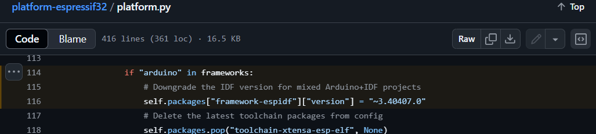

# Anirudh Kumar Worklog for ECE 445, Spring 2025

## 2025-01-26 - Initial Discussion with Teammates

The three of us met for the first time and began discussing the problem further. The initial idea was a generalized type of cup to brew different drinks and allow for both heating and cooling. As we spoke with each other and the TAs, we realized that the cooling aspect would be difficult, as while there are numerous options for heating, there are few or no well-accepted methods for cooling. We thus pivoted to a more specialized project: a self-regulating thermos for brewing tea. Different tea leaves require different water temperatures for brewing, and the goal of this thermos is to handle these aspects for the user. We also brainstormed additional features such as a motor for stirring (to ensure even water distribution and tea strength) and a Bluetooth connection to the user's phone to allow them to control the thermos.

## 2025-02-03 - Reflection on Working with Tea Strength

One important aspect of the tea drinking experience (other than temperature of course) is the strength of the tea. This is a very subjective metric, so our first goal is to try and assign actual values to these. We settled on using a Total Dissolved Solids (TDS) sensor to accomplish this task. Unfortunately, there does not seem to be any existing literature on this. As such, we decided that we would likely have to brew cups of tea ourselves, make an opinion on the strength and measure the TDS value to correlate those numbers to tea strengths.

## 2025-02-25 - Meeting with TAs and Professors

We met with the professor and TAs to present our project proposal. We discussed the different components we planned on implementing as well as additional aspect susch as safety and ethics. We also got some good ideas on alternative solutions if needed. For instance, the professor suggested that if the TDS idea does not work, we could use some sort of light / color sensor, as a stronger tea would have a more opaque color and allow less light through.

## 2025-03-01 - Finalization of Desired Parts

We met up to finalize the parts we needed for our project before we placed the orders. This included our final decision for the ESP32S3 microcontroller board as well as for the motor (needed for stirring), temperature sensor and Peltier heating module. These decisions were based off what devices had support on the PCB design from KiCad as well as what was avaialble in lab.

## 2025-03-06 - Finalization of Design Document

We met up to complete the design document. It was important to better outline how we checked each of our different requirements for the successful completion of this project. It was also illuminating to see the cost if this were a real world project, as this gives a better indication of how such work would be done once we graduate.

## 2025-03-09 - Initial Work with the Microcontroller

We got the delivery of our microcontroller - ESP32S3. This first day with the microcontroller was spent going through the documentation on the Espressidf website. We also learned how to power the device as well as how one would put a program onto it. As an initial test, we wrote a very simple program that just printed "hello world" to the console every ten seconds. After that, I moved onto a program that actually uses the General Purpose Input / Output (GPIO) pins on the microcontroller. Specifically, I connected one of the pins to an LED and resistor in series. Next, I adapted the "hello world" code to set the GPIO pin's output to high every ten seconds rather than printing to the terminal. As such a blinking LED was achieved, and I learned how to use the microcontroller's pins for output purposes.

## 2025-03-11 - Controlling Peripheral Devices via User Input

Of course, we want our thermos to start its operation only when the user says to do so. As such, the next step after figuring out how to manipulate the output values of the GPIO pins was to only turn them high when the user asks for it. I wrote code to take in user input from the terminal. The GPIO pin was also connected to our DC motor, which acts as a stirring mechanism for the thermos. The user types 'motor_on' or 'motor_off' in the terminal which then turns the motor on or off respectively.

## 2025-03-21 - Providing User Input via Bluetooth

We had decided on using Bluetooth rather than Wi-Fi because we would like our thermos to be capable of outdoor usage, where a Wi-Fi network may not necessarily be present. Furthermore, Wi-Fi is needed for situations where we might be transferring more data, but we are not actually transferring too much (instructions to turn on / off, a set temperature or receiving a temperature from the sensor in our thermos). Further, there are two frameworks available to use on the ESP32S3 - Bluedroid and NimBLE. The former can use both classic Bluetooth and Bluetooth Low Energy (BLE), while the latter can just support BLE. Again, given that we will never be exchanging too much data, BLE is preferable. In addition, NimBLE takes up less of a memory footprint, which is desirable when working in a space with limited memory such as a microcontroller. Once I decided on NimBLE, I began working on establishing a connection to the microcontroller from my mobile phone. To be sure that the connection had been made, I wrote the code such that the inbuilt LED on the ESP32S3 would light up when connected to the phone and disconnected. After this, I added a task to accept a boolean value from the phone (0 corresponding to off and 1 corresponding to on) to thus turn the motor on and off. Once set to value, it will stay that way, regardless of the status of the connection, until explicitly changed to a different value.

## 2025-03-24 - Setting the Motor to a Cycle

In the final operation of our product, we of course do not want the motor to be continuously in operation. This wastes power, as all we need from the motor is to allow for a uniform temperature and concentration of tea throughout (needed to get the most accurate values from the temperature and TDS sensors). As such, we settled on a cycle of 3 seconds ON and 27 seconds OFF. The stirring element should start on this cycle when the user sends an 'on' message and exit the cycle immediately when there is an 'off' message (even if it interrupts the cycle). This was a bit more difficult, as the same program should simultaneously be checking the connection and messages from the user while also maintaing this cycle. I ended up creating a task to run in the background to maintain the cycle. A global variable was used to maintain the ON / OFF state of the motor which helped the cycle task do its work.

## 2025-03-29 - Adding the Temperature Sensor

For this project, we are using the DS18B20 temperature sensor. The sensor consists of a metal tube that is immersed into whatever substance is being measured (in this case, the water). Then, a wire is connected to a GPIO pin of the microcontroller. However, this is not a simple 0 or 1 but rather a full data pin. I needed to use special libraries to read this, specifically DallasTemperature and OneWire. The issue is that these libraries are Arduino libraries and cannot be used in Visual Studio Code, which we have been using up till now. After some research, I identified an alternative framework called Platformio that would support both Arduino and Espressidf (which we have been using till now). I set up a Platformio platform and wrote code to read from the temperature sensor using the two aformentioned libraries. It is capable of reading from the temperature sensor, and the sensor itself responds quickly to changes in temperature (created quickly by covering the metal tube part in one's hands). There were initially some difficulties in detecting the sensor which were resolved by fixing some issues on the hardware / circuitry side.

## 2025-04-17 - Integrating Everything

We began working on integrating everything on the software side. A big hurdle came when attempting to combine the Arduino-based code for reading from the temperature sensor with the Bluetooth code from the Espressidf libraries. Despite setting up Platformio to use both Arduino and Espressidf, we were unable to get them to compile. Specifically, the temperature sensor code would compile correctly, but the Espressidf Bluetooth code would not. We were unable to determine the issue today.

## 2025-04-19 - Understanding the Compilation Issue

I figured out why the issue occurred. The reason comes from the following underlying code in Platformio:

